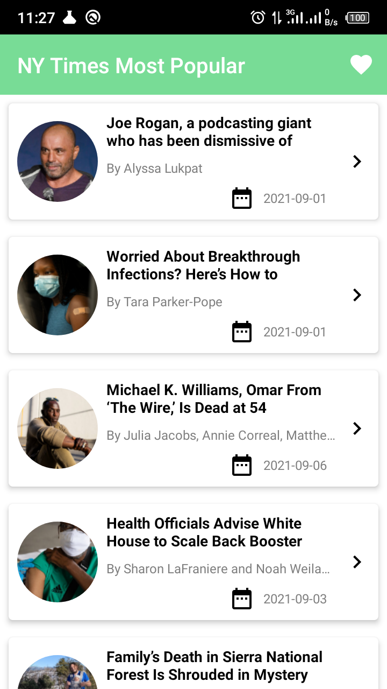
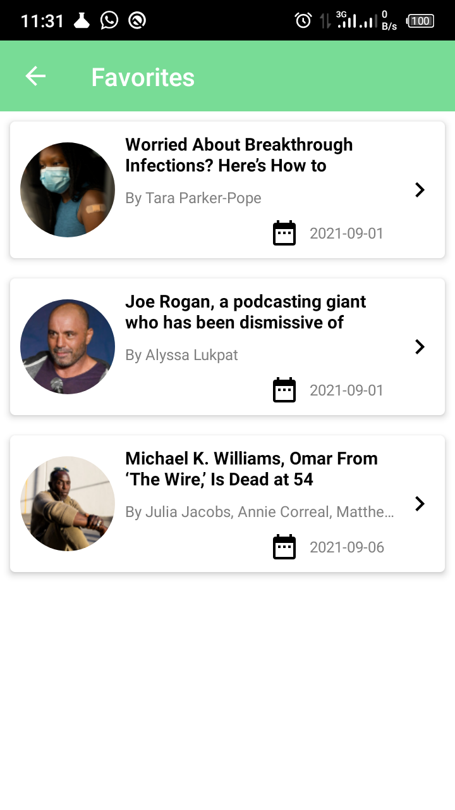

# The New York Times Most Popular Articles

A simple app to hit the New York Times Most Popular Articles API and show a list of articles,
that shows details when items on the list are tapped (a typical master/detail app),
also user able to browse/ add articles to favorite list that implements MVVM architecture using
Dagger2, Retrofit, Coroutines, LiveData, RoomDatabase, Database Debugging, DataBinding and Navigation
Component.

 

    
    
    

 

#How to run the application:
1. Using git CLI or the Github Desktop, clone the project repository from the link below:
https://github.com/Hillary-K-Mutai/NY-Times-Most-Popular.

2. Using IDE of your choice(Android Studio), import the project folder from your PC
Import the gradle for the project,
After Everything is set,

3. Connect an android device or an emulator(AVD) to build and install the project.

4. The project should run and the result is as shown in the screenshots provided

 
   Copyright (C) 2021 Hillary Mutai

